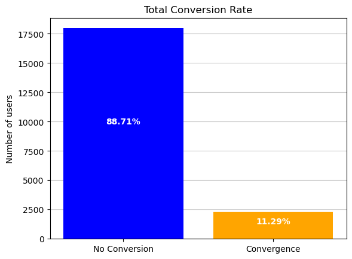

# Data_365_sql

## Data 365 SQL Project: Free-to-Paid Conversion Rate Analysis

Description:
This project analyzes Data 365's dataset, focusing on student engagement and purchases. Key questions addressed include:

### Conversion Rate Analysis:

What is the free-to-paid conversion rate of students who watched a lecture on the 365 platform?

**Methodology:**

- Utilized MySQL for data processing and analysis.
- Joined tables on student engagement and purchases.
- Calculated additional fields for dates and duration.
- Conducted subqueries to determine conversion rate.

**Results:**

Conversion rate: 11.29%
Charts:

[Insert Conversion Rate Chart]
### Duration Analysis:

- What is the average duration between registration and the first lecture?
- What is the average duration between the first lecture and the first subscription purchase?

**Methodology:**

Exported results to Python for further analysis and visualizations.

**Results:**

- Average days between registration and first lecture: 3.42
- Average days between engagement and purchase: 26.24
Charts:

[Insert Registration to First Lecture Duration Chart]
[Insert Engagement to Purchase Duration Chart]

**Interpretation:**

- Explore reasons for registration to understand low conversion.
- Investigate topics with higher conversion rates.
- Address outliers in engagement duration.

### Additional Insights:

- Explored general relationship between registration and purchase.
    -    Interpretation: Identify potential areas for improvement in the user journey.
- Analyzed seasonal variations in registrations and purchases.
    -    Interpretation: Tailor marketing strategies based on seasonal trends.

## Data 365 SQL Project: Student Streaks Analysis

Description:
This project analyzes streak data to identify top learners for feedback. Key question:

What users have the longest streaks?

**Methodology:**

- Processed streak data in MySQL.
- Calculated streak lengths, considering activity and freezes.
- Identified top users and exported results to Python.

**Results:**

36 users with streaks of 30 for additional feedback.
Charts:

[Insert Streak Length Distribution Chart]
### Additional Insights:

- Explored relationships between streak length and freezes.
    -    Interpretation: Relationship between streak length and use of freezes is exceptionally low.
- Analyzed user activity patterns by date and day of the week.
    -    Interpretation: Recognized patterns of decreased use on weekends and during holidays.
- Investigated overall user activity, showing a dedicated user group.
    -    Interpretation: Most users try the platform for a short period, but a dedicated group completes the streak.

